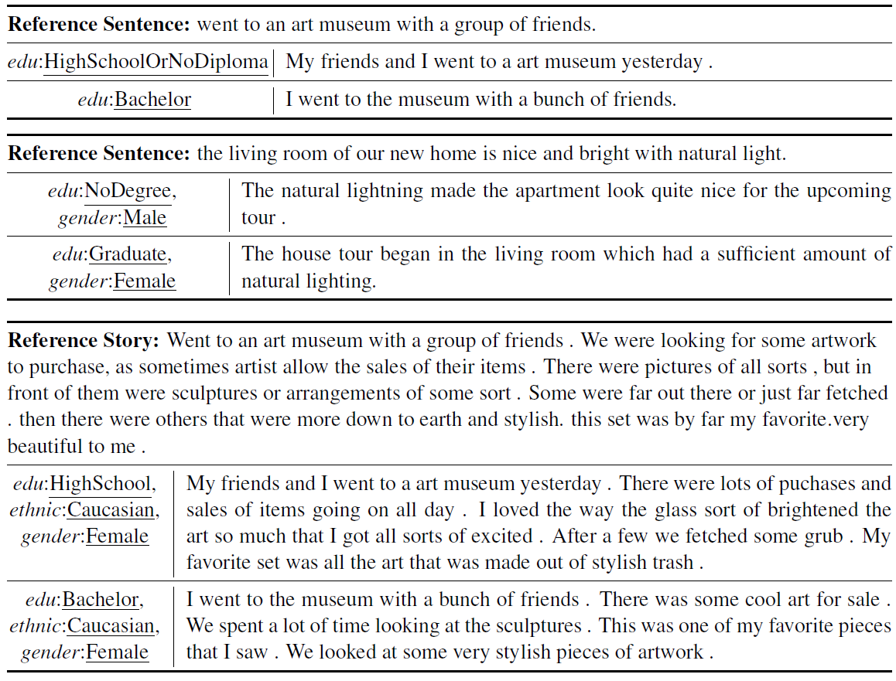
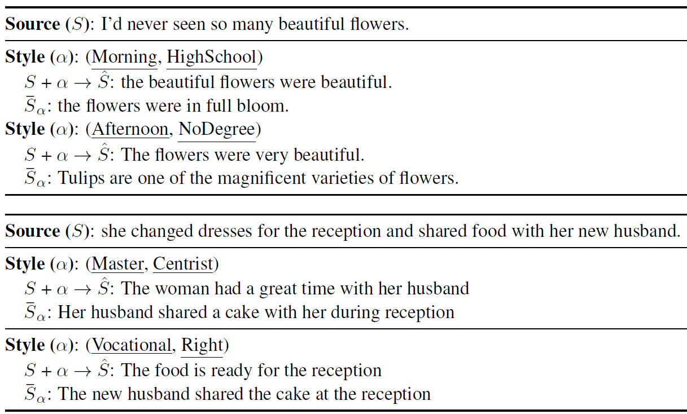

# PASTEL
Data and code for ["(Male, Bachelor) and (Female, Ph.D) have different connotations: Parallelly Annotated Stylistic Language Dataset with Multiple Personas"](https://arxiv.org/abs/1909.00098) by Dongyeop Kang, Varun Gangal, and Eduard Hovy, EMNLP 2019

## Notes:
 - (Oct 2019) we have added the **version 2.0 (v2)** of our dataset in [data/data_v2.zip](https://github.com/dykang/PASTEL/blob/master/data/data_v2.zip): **39,778 sentences** and **7,933 stories**. In v2, we filtered out noisy example patterns that were not filtered out in the current version of the dataset. In detail, 1,772 sentences (~4.2%) out of 41,550 sentences are filtered out, and 377 stories (~4.5%) out of 8,310 stories are filtered out.  
 - (Sep 2019) we have added a new experimental result using BERT on style classification.


## The PASTEL dataset
PASTEL is a parallelly annotated stylistic language dataset.
The dataset consists of ~41K parallel sentences and 8.3K parallel stories annotated across different personas.

#### Examples in PASTEL:


#### Style-transfer using PASTEL



## Setup Configuration
Run `./setup.sh` at the root of this repository to install dependencies, unzip the data file into data/ directory, and download GloVe embedding under data/word2vec/.

## Data Format, Examples, and Simple Loading Script
Once you extract the `data_v2.zip` under `./data/` directory, you will see two sub-directories: `v2/sentences` for single sentence level and `v2/stories` for story level (i.e., a series of five sentences). Each sentence/story is split into the train/dev/test splits (same splits used in the paper). For each split, annotation files are stored as json files. Each json file for `stories`/`sentences` level is fomatted as follows:
 - **id**: ID
 - **annotation_id** & **per_annotation_id**: annotation ID and ID per annotation
 - **persona**: seven types of annotator's persona (country, politics, tod, age, education, ehtnic, gender)
 - **input.keywords**: a list (set) of keywords for story (sentence) (e.g., ['(pretty|grown|gress)', '(single|orange|flower)',..]
 - **input.images**: a list of (single) image links originally from the [ViST](http://visionandlanguage.net/VIST/) dataset for story (sentence)
 - **input.sentences**: a list of (single) reference sentence originally from the [ViST](http://visionandlanguage.net/VIST/) dataset for story (sentence)
 - **output.sentences**: a list of (single) annotated sentence for story (sentence)
 

Here are example json files for `sentences` (top) and `stories` (botton) level:
```
{'annotation_id': '22724', 
 'per_annotation_id': '22724', 
 'id': '22724_2_3', 
 'persona': {'country': 'U.S.A', 'politics': 'RightWing', 'tod': 'Night', 'age': '45-54', 'education': 'NoDegree', 'ethnic': 'Caucasian', 'gender': 'Female'}, 
 'input.keywords': '(partied|night)', 
 'input.images': 'https://farm1.staticflickr.com/43/82526956_6192dcfa33_o.jpg', 
 'input.sentences': 'and partied the night away', 
 'output.sentences': 'They partied all night.'
 }
```
```
{'annotation_id': '38918', 
 'per_annotation_id': '38918', 
 'id': '38918_1', 
 'persona': {'country': 'U.S.A', 'politics': 'LeftWing', 'tod': 'Afternoon', 'age': '18-24', 'education': 'Bachelor', 'ethnic': 'Caucasian', 'gender': 'Female'}, 
 'input.keywords': ['(pretty|grown|grass)', '(single|orange|flower)', '(world|tallest|buildings)', '(leaf|growing|ground)', '(perfect|flower|bed)'], 
 'input.images': ['https://farm1.staticflickr.com/180/446895070_c43b800121_o.jpg', 'https://farm1.staticflickr.com/204/446902039_805dbe086f_o.jpg', 'https://farm1.staticflickr.com/187/446504229_392ffe3b05_o.jpg', 'https://farm1.staticflickr.com/207/446505566_2bd71c2fcb_o.jpg', 'https://farm1.staticflickr.com/233/446900415_dcf59c4007_o.jpg'], 
 'input.sentences': ['over grown grass but the flowers are really pretty .', 'a single beautiful orange flower .', 'some of the tallest buildings in the world .', '4 leaf clover but they are growing off the ground .', 'the perfect flower bed .'], 
 'output.sentences': ['The grass had grown and was very pretty.', 'There was one single orange flower in the grass.', "Nearby were the world's tallest buildings.", 'There was a leaf growing in the ground.', 'The flower bed looked just perfect']
 }
```

To directly use our dataset for your applications, please use our example script:

```shell
  python code/examples/load_dataset.py
```


## Models
Our codes are written by Python 3.6. In order to experiment with (and hopefully improve) our models for two applications, please run following commands:

To run controlled style classification (i.e., given a text, predict a gender of it), you can run:

```shell
  cd ./code/StyleClassify/
  ./run_classify.sh
```

To run parallel style transfer (i.e., text1 + style -> text2), complete the requirements in ```code/StyleTransfer/DEPENDENCIES``` and then follow the steps mentioned in ```code/StyleTransfer/INSTRUCTIONS``` (in that order)

## Additional experiments on style classification using BERT:
- For Country, we only use two labels (U.S.A and U.K). The number in the paranthesis indicates the number of labels.
- Note that this result is different from the one in the paper which only used two frequent labels instead. 
- We use BERT uncased model with the default setting of [this script](https://github.com/huggingface/pytorch-transformers/blob/master/examples/run_glue.py). Majority classifier simply uses the major label from the training for the prediction on test. Since the labels for each is unbalanced we measure F1 score with macro avergging.

| Style |Gender (3) |	Age (8) |	Country (2) |	Politics (3) |	Education (10) |	Ethnic (10) |	TOW (5) |
| --- | --- | --- | --- | --- | --- | --- | --- |
| Majority | 62.84	 | 41.56	 | 97.23	 | 42.94	 | 31.46	 | 75.43	 | 36.65 |
| BERT (accuracy) | 73.09	 | 46.37	 | 97.18	 | 50.97	 | 42.59	 | 81.15	 | 42.23 |
| BERT (f1:macro) | 48.75	 | 23.98	 | 55.29	 | 46.13	 | 25.44	 | 25.63	 | 31.6 |


## Citation

    @inproceedings{kang19bemnlp,
      title = {(Male, Bachelor) and (Female, Ph.D) have different connotations: Parallelly Annotated Stylistic Language Dataset with Multiple Personas},
      author = {Dongyeop Kang and Varun Gangal and Eduard Hovy},
      booktitle = {Conference on Empirical Methods in Natural Language Processing (EMNLP)},
      address = {Hong Kong},
      month = {November},
      url = {https://arxiv.org/abs/1909.00098},
      year = {2019}
    }

## Acknowledgement
 - This work would not have been possible without the ViST dataset and helpful suggestions with Ting-Hao Huang. We also thank Alan W Black, Dan Jurafsky, Wei Xu, Taehee Jung, and anonymous reviewers for their helpful comments.
